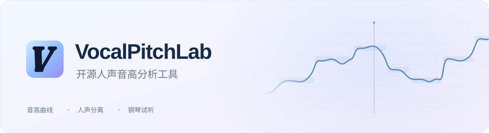
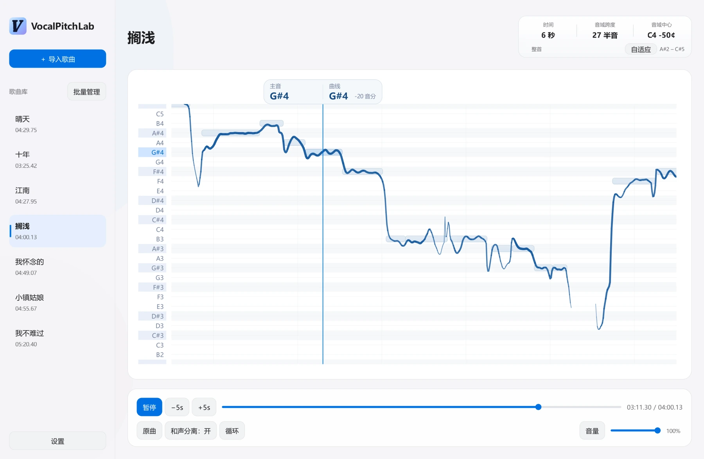
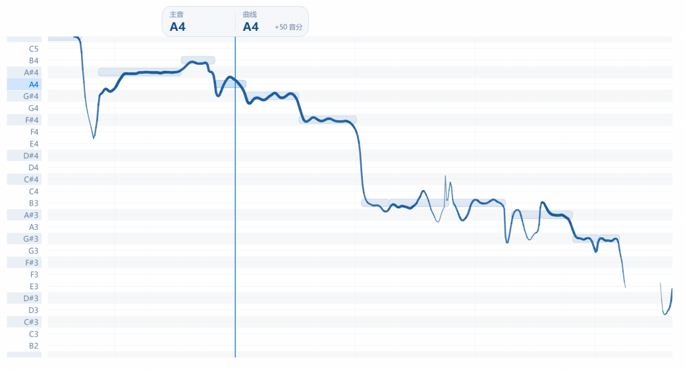
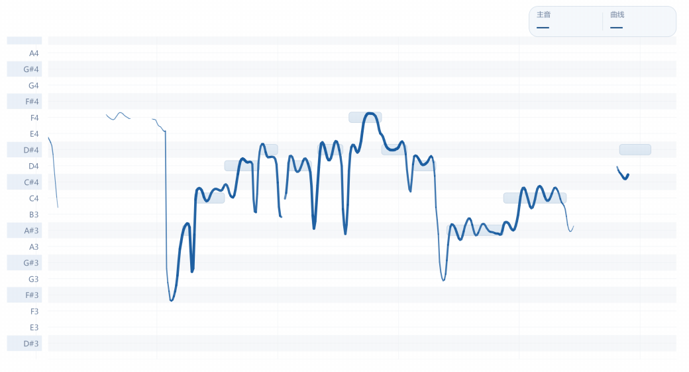

<picture>
  <source media="(prefers-color-scheme: dark)" srcset="docs/images/hero-dark.svg">
  
</picture>

  面向流行音乐的开源人声音高分析应用，在 Windows 本地运行。

  
  
  

  <a href="https://github.com/Atal1a/VocalPitchLab/releases/latest"><strong>GitHub 下载</strong></a>
  &nbsp; · &nbsp;
  <a href="https://pan.quark.cn/s/fec1530accea"><strong>夸克网盘下载</strong></a>
  &nbsp; · &nbsp;
  <a href="INSTALLATION.md">安装说明</a>
  &nbsp; · &nbsp;
  <a href="https://github.com/Atal1a/VocalPitchLab/issues">问题反馈</a>

<picture>
  <source media="(prefers-color-scheme: dark)" srcset="docs/images/workspace-dark.webp">
  
</picture>

## 音高分析

导入歌曲后，软件分离人声并分析音高。连续曲线显示滑音、转音和颤音，主要音符块标出音高与持续时间。支持调整时间和音域范围，查看整段旋律或单个音符。

<picture>
  <source media="(prefers-color-scheme: dark)" srcset="docs/images/pitch-demo-dark.gif">
  
</picture>

## 钢琴试听

点击曲线左侧的音名，试听对应的标准钢琴音。可以暂停后逐音比对，也可以循环播放一段乐句，反复听辨音高。

<picture>
  <source media="(prefers-color-scheme: dark)" srcset="docs/images/piano-demo-dark.gif">
  
</picture>

## 更多功能

| 功能 | 可以做什么 |
| :--- | :--- |
| **人声与原曲** | 切换原曲和分离人声；按歌曲开启或关闭和声分离。 |
| **播放与视图** | 循环播放、调整音量，缩放时间与音域，或使用自适应视图。 |
| **歌曲库** | 导入与批量管理歌曲，保存分析结果和查看位置。 |
| **界面主题** | 支持浅色与深色主题。 |

## 开始使用

1. 从 [GitHub Releases](https://github.com/Atal1a/VocalPitchLab/releases/latest) 或 [夸克网盘](https://pan.quark.cn/s/fec1530accea) 下载同一版本的 `setup.exe` 和**全部 `.bin` 分卷**，放在同一文件夹，保持原文件名。
2. 运行 `setup.exe` 完成安装，无需单独解压分卷，也无需配置 Python 或 CUDA Toolkit。
3. 打开 VocalPitchLab，点击「导入歌曲」，等待分析完成后播放、查看和比对。

兼容的 NVIDIA 显卡和驱动可以加速分析；没有可用的 GPU 加速时会使用 CPU，分析明显较慢。首次安装、从 1.1.0 更新及常见问题，见 [安装说明](INSTALLATION.md)。

部分合唱或高音叠唱可能被和声分离削弱，此时可将当前歌曲的「和声分离」切换为「关」。

## 开发与许可

源码目录、运行方式和依赖见 [开发说明](docs/DEVELOPMENT.md)，版本变化见 [更新记录](CHANGELOG.md)。

项目自有代码采用 [GPL-3.0-only](LICENSE) 许可。第三方组件与模型适用各自许可，见 [第三方说明](THIRD_PARTY_NOTICES.md)。

---

  VocalPitchLab &nbsp; · &nbsp; <a href="https://github.com/Atal1a">Atalia</a>

